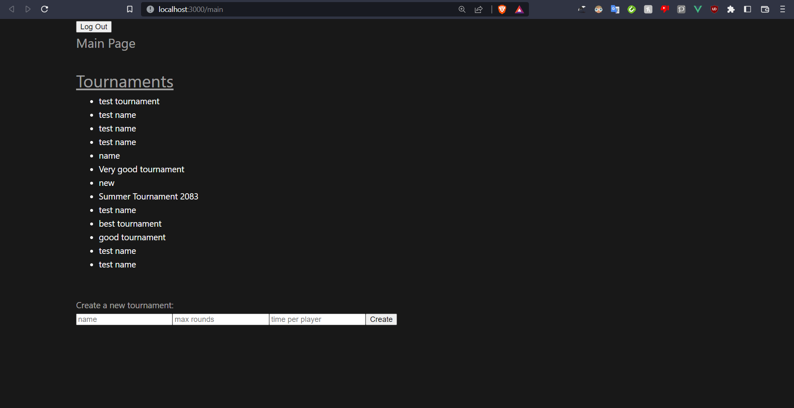

<h1>Code Flow According to Acceptation Criteria</h1>

<h2>Table of Contents</h2>

- [Introduction](#introduction)
- [User story and Acceptation Criteria Description](#user-story-and-acceptation-criteria-description)
- [Frontend](#frontend)
- [Backend](#backend)
- [Code Flow](#code-flow)
  - [Frontend: Submitting a Tournament](#frontend-submitting-a-tournament)
  - [Backend: Recieving a Tournament](#backend-recieving-a-tournament)
  - [Frontend: Fetching all Tournaments](#frontend-fetching-all-tournaments)
  - [Backend: Giving all Tournaments](#backend-giving-all-tournaments)
  - [Frontend: Showing all Tournaments](#frontend-showing-all-tournaments)
- [Conclusion](#conclusion)
- [Summary](#summary)


# Introduction

In this document, I will show the functionality of my application and how the functionality aligns with the user's needs. The user's needs are explained in user stories and each of them has acceptation criteria, which are important for the development of the application.

# User story and Acceptation Criteria Description

The main user story for the application is the following: 

*'As a tournament host, I want to create tournaments on the site, so that the features related to tournaments can help me when organizing one.'*

The acceptation criteria for measuring if this user story is successfully implemented in the application, are the following:

1. *Tournament data can be filled in from the frontend.*
2. *Tournament data can be sent to the tournament service through a POST request.*
3. *Tournament data can be retrieved from the tournament service through a GET request.* 
4. *Tournament data can be stored in the tournament database.*
5. *Tournament data can be rejected if the data is not valid.*
6. *Tournament data can be shown on the frontend.*
7. *After a tournament is created on the frontend, there must be visual feedback for showing that the tournament was created successfully.*

My plan for implementing all of the above criteria is to make input fields and a button for the user on the frontend. When a button is clicked, the tournament is created and saved in the tournament database after a POST request. Then, the names of all tournaments will be visible on the same page where the user created a tournament, including the name of the tournament that was just created. Basically, there should be a round trip of code flow and tournament data, starting in the frontend, going through the backend, and then returning to the frontend again.

Before I explain how these acceptation criteria should be implemented in the application, I want to briefly explain the structure of my front- and backend.

# Frontend

In the frontend, I am working with Vue.js 3, which is the latest version of Vue. Vue.js is a single-page component-based Javascript framework. This means that you can create multiple files (components) and define html, javascript and other code there. Then, you can use multiple components in a parent component, which can then be used in a view component. Because Vue.js is single-page based, you only show one real page to the user. However, because you can create view components in Vue, you can load different content into the page by switching through the view components. This creates an illusion of there being multiple pages for the user.

I have many other files in the Chess Tournament Manager, but the files that are especially relevant for the acceptation criteria above, are the following:

```
src
|   App.vue
|
+---components
|   |   CreateTournament.vue
|   |   TournamentList.vue
|
+---services
|       TournamentService.js
|
\---views
        Main.vue
```

The App.vue is the main component, where all the other components get loaded into. The direct children of the App component are the view components. Navigation between the views is possible with the vue-router.

<details><summary>Click to show App.vue code</summary>
<p>

```javascript
<template>
<div class="container">
    <router-view></router-view>
</div>
</template>
```
</p>
</details>
<br/>

This is all that is needed for App.vue. The `router-view` tag makes sure that the appropriate view component is loaded with the help of the router.

There are a couple of view components, but the one relevant for this user story is 'Main.vue'. This is the main 'page' for the Chess Tournament manager and where I want to implement the functionality for the acceptation criteria. The Main component has the CreateTournament component and the TournamentList component.

[](../../Images/frontend-main-page.png)

*Main page*

<details><summary>Click to show Main.vue code</summary>
<p>

```javascript
<template>
    <NavigationBar />
    <h2>Main Page</h2>
    <br/>
    <TournamentList />
    <br/>
    <br/>
    <CreateTournament />
</template>

<script>
    import CreateTournament from "@/components/CreateTournament.vue";
    import NavigationBar from "@/components/NavigationBar.vue";
    import TournamentList from "@/components/TournamentList.vue";

    export default {
        components: {
            NavigationBar,
            TournamentList,
            CreateTournament
        }
    };
</script>
```
</p>
</details>
<br/>

The main page has two other components in it. The 'TournamentList', which is responsible for loading all the names of all tournaments onto the screen, and the 'CreateTournament' component, which has the input fields and the submit button.

<details><summary>Click to show TournamentList.vue code</summary>
<p>

```javascript
<template>
    <div>
        <h1>Tournaments</h1>
        <ul>
            <li v-for="tournament of tournaments" :key="tournament.id">
                {{ tournament.name }}
            </li>
        </ul>
    </div>
</template>

<script>
import { fetchTournaments } from "@/services/TournamentService.js"

export default {
    name: "TournamentList",
    data() {
    return {
        tournaments: []
    };
    },
    async mounted() {
    await this.getTournaments();
    },
    methods: {
    async getTournaments() {
        try {
        this.tournaments = await fetchTournaments();
        } catch (e) {
        console.error(e);
        }
    }
    }
};
</script>
```
</p>
</details>

<br/>

<details><summary>Click to show CreateTournament.vue code</summary>
<p>

```javascript
<template>
    <p>Create a new tournament:</p>
    <input v-model="name" placeholder="name"/>
    <input v-model="maxRounds" placeholder="max rounds"/>
    <input v-model="timePerPlayer" placeholder="time per player"/>
    <button class="button__login" @click="createTournament(name, maxRounds, timePerPlayer)">Create</button>
</template>

<script>  
import {  v4 as uuidv4 } from 'uuid';
import { createTournament } from '@/services/TournamentService';

export default {
    name: "TournamentList",
    data() {
    return {
        hostId: uuidv4(),
        name: '',
        status: 'PLANNED',
        startTime: '2025-06-11T16:00:00.000Z',
        maxRounds: '',
        timePerPlayer: ''
    }
    },
    methods: {
        async createTournament(name, maxRounds, timePerPlayer) {
            const tournament = {
                hostId: this.hostId,
                name: name,
                status: this.status,
                startTime: this.startTime,
                maxRounds: maxRounds,
                timePerPlayer: timePerPlayer
            }

            await createTournament(tournament)
            .then(function (response) {
                window.location.reload()
            })
        }
    }
};
</script>
```
</p>
</details>
<br/>

<br/>

The two components above load and send data to the TournamentService. This service is responsible for making HTTP requests with the tournament API and sending the data back to view components.

<details><summary>Click to show TournamentService.js code</summary>
<p>

```javascript
import axios from 'axios'

const BASE_URL = 'http://localhost:8080/tournament'

export const fetchTournaments = async () => {
    let data
    try {
        data = (await axios.get(`${BASE_URL}`)).data
    }
    catch (error) {
        console.log(error);
    }
return data
}

export const createTournament = async (tournament) => {
    let data
    try {
        data = (await axios.post(`${BASE_URL}`, tournament)).data
    }
    catch (error) {
        console.log(error);
    }
return data
}
```
</p>
</details>
<br/>

# Backend

I have multiple backend services, but the one that is especially relevant for this user story is the Tournament service. This service is a Spring Boot application and uses a Redis instance as its database. 

This is the file structure of the tournament-svc, containing the most relevant files for this user story:
```
src/main/java/com/chesstournamentmanager/tournamentsvc
|
|                                                  
+---config                                         
|       MainConfiguration.java                     
|       TournamentData.java                        
|                                                  
+---controllers                                    
|       TournamentController.java                  
|                                                  
+---models                                         
|       RequestModel.java                          
|       Tournament.java                            
|                                                  
+---repositories                                   
|       TournamentRepository.java
|
\---services
        TournamentService.java
```

TournamentController.java is the file that defines the HTTP methods of the Tournament API. When a HTTP request is made, the controller will execute code and then ask TournamentService.java to validate the sent data and to then make the appropriate action. If the sent data is accepted by the service, it will execute a method from TournamentRepository.java. If the sent data is rejected by the service, the error is sent back to the controller, and the controller will send the correct data back.

<details><summary>Click to show TournamentController.java code</summary>
<p>

```java
package com.chesstournamentmanager.tournamentsvc.controllers;

import com.chesstournamentmanager.tournamentsvc.models.RequestModel;
import com.chesstournamentmanager.tournamentsvc.models.Tournament;
import com.chesstournamentmanager.tournamentsvc.services.TournamentService;
import org.springframework.beans.factory.annotation.Autowired;
import org.springframework.http.HttpStatus;
import org.springframework.http.ResponseEntity;
import org.springframework.web.bind.annotation.*;
import org.springframework.web.server.ResponseStatusException;

import java.time.LocalDateTime;
import java.util.List;
import java.util.Optional;
import java.util.UUID;

@RestController
@RequestMapping(path = "tournament")
public class TournamentController {

    private final TournamentService tournamentService;

    @Autowired
    public TournamentController(TournamentService tournamentService) {
        this.tournamentService = tournamentService;
    }


    @GetMapping
    public ResponseEntity<List<Tournament>> getTournaments() {
        return new ResponseEntity<>(tournamentService.getTournaments(), HttpStatus.OK);
    }

    @GetMapping("/{id}")
    public ResponseEntity<Tournament> getTournament(
            @PathVariable UUID id) {
        Optional<Tournament> tournament = tournamentService.getTournament(id);
        if (tournament.isEmpty()) {
            throw new ResponseStatusException(
                    HttpStatus.NOT_FOUND, "Tournament with id " + id + " not found"
            );
        }
        return new ResponseEntity<>(tournament.get(), HttpStatus.OK);
    }


    @PostMapping
    public ResponseEntity<Tournament> addTournament(@RequestBody RequestModel requestModel) {
        Tournament tournament = convertToEntity(requestModel);

        String message = tournamentService.tournamentValidation(tournament);
        if (!message.isEmpty()) {
            throw new ResponseStatusException(
                    HttpStatus.BAD_REQUEST,
                    message
            );
        }

        tournamentService.addNewTournament(tournament);
        Optional<Tournament> returnedTournament = tournamentService.getTournament(tournament.getId());
        if (returnedTournament.isEmpty()) {
            throw new ResponseStatusException(
                    HttpStatus.INTERNAL_SERVER_ERROR,
                    "The tournament was not added successfully. Ask the developers to fix this issue."
            );
        }
        return new ResponseEntity<>(returnedTournament.get(), HttpStatus.CREATED);
    }

    @PutMapping("/{id}")
    public ResponseEntity<Tournament> updateTournament(
            @PathVariable UUID id,
            @RequestParam(required = false) UUID hostId,
            @RequestParam(required = false) String name,
            @RequestParam(required = false) Tournament.Status status,
            @RequestParam(required = false) LocalDateTime startTime,
            @RequestParam(required = false) int maxRounds,
            @RequestParam(required = false) int timePerPlayer) {
        tournamentService.updateTournament(id, hostId, name, status, startTime, maxRounds, timePerPlayer);
        Optional<Tournament> returnedTournament = tournamentService.getTournament(id);
        if (returnedTournament.isEmpty()) {
            throw new ResponseStatusException(
                    HttpStatus.INTERNAL_SERVER_ERROR,
                    "The tournament was not updated successfully. Ask the developers to fix this issue."
            );
        }
        return new ResponseEntity<>(returnedTournament.get(), HttpStatus.OK);
    }


    @DeleteMapping("/{id}")
    public String deleteTournament(@PathVariable UUID id) {
        tournamentService.deleteTournament(id);
        return "Tournament with ID " + id + " has been deleted";
    }


    private Tournament convertToEntity(RequestModel requestModel) {
        return new Tournament(
                requestModel.getHostId(),
                requestModel.getName(),
                requestModel.getStatus(),
                requestModel.getStartTime(),
                requestModel.getMaxRounds(),
                requestModel.getTimePerPlayer()
        );
    }
}
```
</p>
</details>
<br/>

<details><summary>Click to show TournamentService.java code</summary>
<p>

```java
package com.chesstournamentmanager.tournamentsvc.services;

import com.chesstournamentmanager.tournamentsvc.models.Tournament;
import com.chesstournamentmanager.tournamentsvc.repositories.TournamentRepository;
import org.springframework.beans.factory.annotation.Autowired;
import org.springframework.stereotype.Service;
import org.springframework.transaction.annotation.Transactional;

import java.time.LocalDateTime;
import java.util.List;
import java.util.Objects;
import java.util.Optional;
import java.util.UUID;

@Service
public class TournamentService {

    public static final String MESSAGE_NO_HOST_ID = "No host ID was provided";
    public static final String MESSAGE_EMPTY_HOST_ID = "The provided host ID was empty";
    public static final String MESSAGE_NO_NAME = "No name was provided";
    public static final String MESSAGE_EMPTY_NAME = "The provided name was empty";
    public static final String MESSAGE_NO_STATUS = "No status was provided";
    public static final String MESSAGE_PLANNED_TOURNAMENT_STARTS_IN_PAST = "A planned tournament may not start before the current time";
    public static final String MESSAGE_NON_PLANNED_TOURNAMENT_STARTS_IN_FUTURE = "An tournament which is ongoing or has ended may not start after the current time";
    public static final String MESSAGE_NO_START_TIME = "No start time was provided";
    public static final String MESSAGE_NO_MAX_ROUNDS = "No maximum rounds were provided";
    public static final String MESSAGE_NO_TIME_PER_PLAYER = "No amount of time per player was provided";

    private final TournamentRepository tournamentRepository;

    @Autowired
    public TournamentService(TournamentRepository tournamentRepository) {
        this.tournamentRepository = tournamentRepository;
    }

    // Read methods

    public List<Tournament> getTournaments() {
        return (List<Tournament>)tournamentRepository.findAll();
    }

    public Optional<Tournament> getTournament(UUID id) {
        return tournamentRepository.findById(id);
    }

    // Create methods

    public void addNewTournament(Tournament tournament) {
        tournamentRepository.save(tournament);
    }

    // Update methods

    @Transactional
    public void updateTournament(UUID id, UUID hostId, String name, Tournament.Status status, LocalDateTime startTime, int maxRounds, int timePerPlayer) {
        Tournament tournament = tournamentRepository.findById(id)
                .orElseThrow(() -> new IllegalStateException(
                        "Tournament with id " + id + " does not exist"
                ));

        status = checkStatus(tournament, status, startTime);

        if (hostId != null &&
                !hostId.toString().isBlank() &&
            !Objects.equals(tournament.getHostId(), hostId)) {
            tournament.setHostId(hostId);
        }

        if (name != null &&
                !name.isBlank() &&
                !Objects.equals(tournament.getName(), name)) {
            tournament.setName(name);
        }

        if (status != null &&
                !Objects.equals(tournament.getStatus(), status)) {
            tournament.setStatus(status);
        }

        if (startTime != null &&
            !Objects.equals(tournament.getStartTime(), startTime)) {
            tournament.setStartTime(startTime);
        }

        if (maxRounds > 0 &&
                !Objects.equals(tournament.getMaxRounds(), maxRounds)) {
            tournament.setMaxRounds(maxRounds);
        }

        if (timePerPlayer > 0 &&
                !Objects.equals(tournament.getTimePerPlayer(), timePerPlayer)) {
            tournament.setTimePerPlayer(timePerPlayer);
        }
    }

    // Do something like this, but event-driven.
    @Transactional
    public void startTournament(Tournament tournament) {
        if (tournament.getStatus() == Tournament.Status.PLANNED && tournament.getStartTime().isBefore(LocalDateTime.now())) {
            tournament.setStatus(Tournament.Status.ONGOING);
        }
    }

    // Delete methods

    public void deleteTournament(UUID id) {
        boolean exists = tournamentRepository.existsById(id);
        if (!exists) {
            throw new IllegalStateException("Tournament with id " + id + " does not exist");
        }

        tournamentRepository.deleteById(id);
    }

    // Validation methods

    public String tournamentValidation(Tournament tournament) {
        if (tournament.getHostId() == null) {
            return MESSAGE_NO_HOST_ID;
        }
        if (tournament.getHostId().toString().isBlank()) {
            return MESSAGE_EMPTY_HOST_ID;
        }

        if (tournament.getName() == null) {
            return MESSAGE_NO_NAME;
        }

        if (tournament.getName().isBlank()) {
            return MESSAGE_EMPTY_NAME;
        }

        if (tournament.getStatus() == null) {
            return MESSAGE_NO_STATUS;
        }

        if (tournament.getStartTime() == null){
            return MESSAGE_NO_START_TIME;
        }

        if (!plannedTournamentIsInTheFuture(tournament.getStatus(), tournament.getStartTime())) {
            return MESSAGE_PLANNED_TOURNAMENT_STARTS_IN_PAST;
        }

        if (!ongoingOrEndedTournamentIsInThePast(tournament.getStatus(), tournament.getStartTime())) {
            return MESSAGE_NON_PLANNED_TOURNAMENT_STARTS_IN_FUTURE;
        }

        if (tournament.getMaxRounds() <= 0) {
            return MESSAGE_NO_MAX_ROUNDS;
        }

        if (tournament.getTimePerPlayer() <= 0) {
            return MESSAGE_NO_TIME_PER_PLAYER;
        }

        return "";
    }

    // Private methods

    private Tournament.Status checkStatus(Tournament tournament, Tournament.Status status, LocalDateTime startTime) {
        boolean statusChanged = false;
        Tournament.Status tempStatus;
        LocalDateTime tempStartTime;

        if (status != null && !Objects.equals(tournament.getStatus(), status)) {
            tempStatus = status;
            statusChanged = true;
        } else {
            tempStatus = tournament.getStatus();
        }

        if (startTime != null && !Objects.equals(tournament.getStartTime(), startTime)) {
            tempStartTime = startTime;
        } else {
            tempStartTime = tournament.getStartTime();
        }
        
        if (!plannedTournamentIsInTheFuture(tempStatus, tempStartTime)) {
            if (tempStartTime.isBefore(tournament.getFinishTime())) {
                return Tournament.Status.ONGOING;
            } else {
                return Tournament.Status.CANCELLED;
            }
        }
        
        if (!ongoingOrEndedTournamentIsInThePast(tempStatus, tempStartTime)) {
            if (statusChanged) {
                throw  new IllegalStateException("Can't put the tournament's status to this value due to its start date");
            } else {
                throw new IllegalStateException("Can't put the tournament's start date to this value due to its status");
            }
        }

        return status;
    }

//     Will always be true when checking a tournament that is not planned, because this method should only check planned tournaments.
//     Will be false when a tournament is planned, and it starts before the current time.
    private boolean plannedTournamentIsInTheFuture(Tournament.Status status, LocalDateTime startTime) {
        return status != Tournament.Status.PLANNED || startTime.isAfter(LocalDateTime.now());
    }

    // Will always be true when checking a tournament that is planned, because this method should only check tournaments that are ongoing or have ended.
    // Will be false when a tournament is ongoing or has ended, and it starts after the current time.
    private boolean ongoingOrEndedTournamentIsInThePast(Tournament.Status status, LocalDateTime startTime) {
        return status == Tournament.Status.PLANNED || status == Tournament.Status.CANCELLED || startTime.isBefore(LocalDateTime.now());
    }
}
```
</p>
</details>
<br/>

<details><summary>Click to show TournamentRepository.java code</summary>
<p>

```java
package com.chesstournamentmanager.tournamentsvc.repositories;

import com.chesstournamentmanager.tournamentsvc.models.Tournament;
import org.springframework.data.repository.CrudRepository;
import org.springframework.stereotype.Repository;

import java.util.UUID;

@Repository
public interface TournamentRepository extends CrudRepository<Tournament, UUID> {

}
```
</p>
</details>
<br/>

# Code Flow

## Frontend: Submitting a Tournament
<br/>

**CreateTournament.vue**

When filling in data on the Main.vue page and pressing the button to create a tournament, this will be the order of code which will be executed in the frontend.

```javascript
<input v-model="name" placeholder="name"/>
<input v-model="maxRounds" placeholder="max rounds"/>
<input v-model="timePerPlayer" placeholder="time per player"/>
<button class="button__login" @click="createTournament(name, maxRounds, timePerPlayer)">Create</button>
```

The data present in the input fields will be passed to the `createTournament()` method after the `@click` event on the button has fired.

```javascript
async createTournament(name, maxRounds, timePerPlayer) {
    const tournament = {
        hostId: this.hostId,
        name: name,
        status: this.status,
        startTime: this.startTime,
        maxRounds: maxRounds,
        timePerPlayer: timePerPlayer
    }

    await createTournament(tournament)
    // ...
}
```

**TournamentService.js**

A tournament is created with the data present in the component and the 'createTournament' method from Tournament.js is used.

```javascript
export const createTournament = async (tournament) => {
    let data
    try {
        data = (await axios.post(`${BASE_URL}`, tournament)).data
    }
    // ...
}
```

## Backend: Recieving a Tournament
<br/>

**TournamentController.java**

The tournament data then gets sent to the backend and arrives at the Tournament controller, where the HTTP methods for the API are defined. The data arrives at the method defining the POST request functionality.

```java
@PostMapping
public ResponseEntity<Tournament> addTournament(@RequestBody RequestModel requestModel) {
    Tournament tournament = convertToEntity(requestModel);
    // ...
}
```

For the above code, data present in the RequestModel is asked for. After that, the data is then converted to the actual Tournament domain model.

```java
private Tournament convertToEntity(RequestModel requestModel) {
    return new Tournament(
            requestModel.getHostId(),
            requestModel.getName(),
            requestModel.getStatus(),
            requestModel.getStartTime(),
            requestModel.getMaxRounds(),
            requestModel.getTimePerPlayer()
    );
}
```

After that, it is checked whether the Tournament is actually valid.

```java
@PostMapping
public ResponseEntity<Tournament> addTournament(@RequestBody RequestModel requestModel) {
    Tournament tournament = convertToEntity(requestModel);

    String message = tournamentService.tournamentValidation(tournament);
    // ...
}
```

**TournamentService.java**

The method for seeing whether the Tournament is valid, is defined in the service. The method performs a couple of checks to see if the message is valid. If the message is valid, the `message` variable will remain empty. If it isn't valid, the `message` variable will then be defined with the appropriate string.

```java
public String tournamentValidation(Tournament tournament) {
    if (tournament.getHostId() == null) {
        return MESSAGE_NO_HOST_ID;
    }
    if (tournament.getHostId().toString().isBlank()) {
        return MESSAGE_EMPTY_HOST_ID;
    }

    if (tournament.getName() == null) {
        return MESSAGE_NO_NAME;
    }

    if (tournament.getName().isBlank()) {
        return MESSAGE_EMPTY_NAME;
    }

    if (tournament.getStatus() == null) {
        return MESSAGE_NO_STATUS;
    }

    if (tournament.getStartTime() == null){
        return MESSAGE_NO_START_TIME;
    }

    if (!plannedTournamentIsInTheFuture(tournament.getStatus(), tournament.getStartTime())) {
        return MESSAGE_PLANNED_TOURNAMENT_STARTS_IN_PAST;
    }

    if (!ongoingOrEndedTournamentIsInThePast(tournament.getStatus(), tournament.getStartTime())) {
        return MESSAGE_NON_PLANNED_TOURNAMENT_STARTS_IN_FUTURE;
    }

    if (tournament.getMaxRounds() <= 0) {
        return MESSAGE_NO_MAX_ROUNDS;
    }

    if (tournament.getTimePerPlayer() <= 0) {
        return MESSAGE_NO_TIME_PER_PLAYER;
    }

    return "";
}
```

**TournamentController.java**

If the message is empty, an HTTP error response will be thrown and show the message to the frontend. If the message is empty, it means the tournament is valid, which means that the tournament can be saved.

```java
@PostMapping
public ResponseEntity<Tournament> addTournament(@RequestBody RequestModel requestModel) {
    // ...
    String message = tournamentService.tournamentValidation(tournament);
    if (!message.isEmpty()) {
        throw new ResponseStatusException(
                HttpStatus.BAD_REQUEST,
                message
        );
    }

    tournamentService.addNewTournament(tournament);
    // ...
}
```

**TournamentService.java**

This method in the tournament service executes the `save()` method from the tournament repository, which saves the tournament in Redis. Since the repository is empty and only implements the CrudRepository, I won't show it every time.

```java
public void addNewTournament(Tournament tournament) {
    tournamentRepository.save(tournament);
}
```

**TournamentController.java**

After the tournament is saved, the complete tournament data should be sent back again. The service is called to get the tournament that was just saved.

```java
@PostMapping
public ResponseEntity<Tournament> addTournament(@RequestBody RequestModel requestModel) {
    // ...
    tournamentService.addNewTournament(tournament);
    Optional<Tournament> returnedTournament = tournamentService.getTournament(tournament.getId());
    // ...
}
```

**TournamentService.java**

This method gets the tournament with the ID that was passed in.

```java
public Optional<Tournament> getTournament(UUID id) {
    return tournamentRepository.findById(id);
}
```

**TournamentController.java**

If the tournament could not be retrieved, it means that there is an issue in the application. When this happens, the appropriate HTTP error will be thrown. If the tournament is successfully retrieved, it will be sent back to the frontend.

```java
@PostMapping
public ResponseEntity<Tournament> addTournament(@RequestBody RequestModel requestModel) {
    // ...
    Optional<Tournament> returnedTournament = tournamentService.getTournament(tournament.getId());
    if (returnedTournament.isEmpty()) {
        throw new ResponseStatusException(
                HttpStatus.INTERNAL_SERVER_ERROR,
                "The tournament was not added successfully. Ask the developers to fix this issue."
        );
    }
    return new ResponseEntity<>(returnedTournament.get(), HttpStatus.CREATED);
}
```

## Frontend: Fetching all Tournaments
<br/>

**TournamentService.js**

If no HTTP error is thrown, the tournament data will be successfully retrieved and sent to the vue component which called the function.

```javascript
export const createTournament = async (tournament) => {
    // ...
    try {
        data = (await axios.post(`${BASE_URL}`, tournament)).data
    }
    catch (error) {
        console.log(error);
    }
  return data
}
```

**CreateTournament.vue**

After the tournament is created, the application will reload, causing all of the components to reload. This means that all components will go through all of their lifecycle hooks again.

```javascript
async createTournament(name, maxRounds, timePerPlayer) {
    // ...

    await createTournament(tournament)
    .then(function (response) {
        window.location.reload()
    })
}
```

**TournamentList.vue**

This is the code that is executed once the `mounted()` lifecycle hook is happening. This is called right after the first render of the component. 

```javascript
async mounted() {
    await this.getTournaments();
}
```

The method for getting all tournaments is then executed. 

```javascript
async getTournaments() {
    try {
        this.tournaments = await fetchTournaments();
    } catch (e) {
        console.error(e);
    }
}
```

**TournamentService.js**

The method here then requests to get all the tournaments from the backend.

```javascript
export const fetchTournaments = async () => {
    let data
    try {
        data = (await axios.get(`${BASE_URL}`)).data
    }
    catch (error) {
        console.log(error);
    }
  return data
}
```

## Backend: Giving all Tournaments
<br/>

**TournamentController.java**

The request arrives to this method in the controller. The controller asks the service to get all of the tournaments.

```java
@GetMapping
public ResponseEntity<List<Tournament>> getTournaments() {
    return new ResponseEntity<>(tournamentService.getTournaments(), HttpStatus.OK);
}
```

**TournamentService.java**

The method in the service where all tournaments are retrieved.

```java
public List<Tournament> getTournaments() {
    return (List<Tournament>)tournamentRepository.findAll();
}
```

After that, the controller sends the tournaments to the frontend.

## Frontend: Showing all Tournaments
<br/>

**TournamentService.js**

If the request fails, the error will be shown in the logs and the tournament data will not be used. If the request was successful, the tournaments will be returned.

```javascript
export const fetchTournaments = async () => {
    let data
    try {
        data = (await axios.get(`${BASE_URL}`)).data
    }
    catch (error) {
        console.log(error);
    }
  return data
}
```

**TournamentList.vue**

The recieved tournaments are then saved in the `tournaments` array.

```javascript
async getTournaments() {
    try {
        this.tournaments = await fetchTournaments();
    } catch (e) {
        console.error(e);
    }
}
```

And finally, each tournament present in the `tournaments` array will then be shown to the user.

```javascript
<ul>
    <li v-for="tournament of tournaments" :key="tournament.id">
        {{ tournament.name }}
    </li>
</ul>
```

# Conclusion

As was shown in the code flow, there are input fields and a button present in the frontend. After the button is clicked, the tournament is created and saved in the tournament database after a POST request. The names of all tournaments will be visible on the same page where the user created a tournament. The round trip was implemented successfully, which means that the acceptation criteria are now also successfully implemented in the application.

# Summary

In this document, a user story and its acceptation criteria were analyzed. The important application code was shown and the round trip, showing the successful implementation of the acceptation criteria.