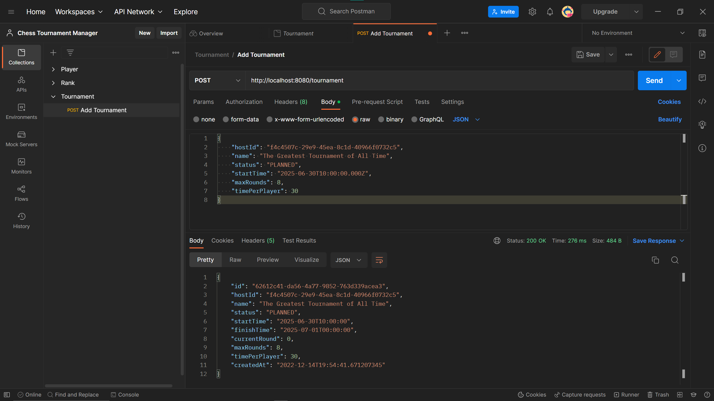
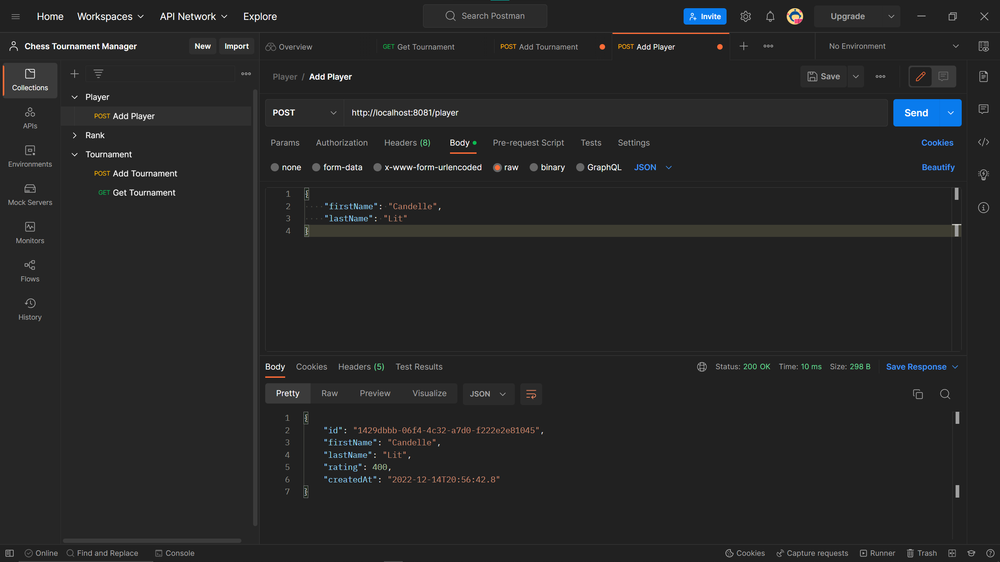

<h1> Database Research </h1>

<h2> Table of Contents </h2>

- [Introduction](#introduction)
- [My Requirements](#my-requirements)
  - [The database needs to be fast](#the-database-needs-to-be-fast)
  - [The database should be NoSQL](#the-database-should-be-nosql)
- [Database Options](#database-options)
  - [Redis](#redis)
  - [MongoDB](#mongodb)
  - [Cassandra](#cassandra)
  - [Scylla](#scylla)
- [Implementation](#implementation)
  - [Dockerizing the Application](#dockerizing-the-application)
  - [Redis Implementation](#redis-implementation)
  - [MongoDB Implementation](#mongodb-implementation)
  - [Scylla Implementation](#scylla-implementation)
- [Benchmarking](#benchmarking)
  - [Redis Benchmark](#redis-benchmark)
  - [MongoDB Benchmark](#mongodb-benchmark)
- [Conclusion](#conclusion)
- [Sources](#sources)
- [DOT Framework Matrix](#dot-framework-matrix)

# Introduction

For this project, I need to choose a suitable database for all of my services. Since all of my services work very similar, I only want to choose one type of database. I will then use multiple instances of that database type for my services.


# My Requirements

## The database needs to be fast

I want my website to be as responsive as possible. It would be a shame if I used a slow database while using such a fast module bundler like Vite. The database must also be able to scale well, in case many people use the website. This is not that much as a requirement though. It is more important that the database is fast than it is scalable.

## The database should be NoSQL

There are multiple reasons why I don't want to use a database with SQL. First of all, SQL databases are generally slower than NoSQL databases. According to a Rochester study, key-value storage databases are especially fast (https://www.cs.rochester.edu/courses/261/fall2017/termpaper/submissions/06/Paper.pdf). Furthermore, it is easier to do scaling when using NoSQL databases. When scaling with SQL databases, you have to migrate to a more expensive server (verticle scaling). When scaling with NoSQL databases, you can just add more cheaper servers (horizontal scaling) (https://www.mongodb.com/nosql-explained/nosql-vs-sql, https://www.geeksforgeeks.org/sql-vs-nosql-which-one-is-better-to-use/). Lastly, I want to use NoSQL, because I have never used a NoSQL database in an individual project before and I would like to gain more experience by using it in this project.


# Database Options

For my database options, I decided it would be good to pick different types of NoSQL databases, to test the theory that key-value databases are the fastest. I have also picked popular databases of each type, which are said to be very fast.

## Redis
*Website: https://redis.com/*

**What type of database is Redis?**

Redis is a type of database known as a key-value database. In a key-value database, data is stored and retrieved using a unique key that identifies the particular item of data. The data (value) associated with a key can be any type of data, such as strings, integers, lists, dates, UUID's and more. Key-value databases are typically very fast and scalable, making them well-suited for applications that require quick access to large amounts of data.

[](../Images/redis_data_types.png)

*Data types in Redis*

**In what scenarios is Redis often used?**

Redis is a good option for applications which need to handle lots of small continuous reads and writes. It is more often used as a cache, but can also be used as a data store. It can also store data in-memory, which allows these actions to be done faster. It is also ideal for applications that don’t require frequent updates or need to support complex queries.

Redis is often used for the following use-cases:

- Caching
- Chatting, messaging, and queues
- Gaming leaderboards
- Session store
- Rich media streaming
- Geospatial
- Machine Learning
- Real-time analytics

For more information about these use-cases, go to [this page](https://aws.amazon.com/redis/#Popular_Redis_Use_Cases)

**How popular is Redis?**


**Which large companies use Redis?**


**How fast is Redis?**


## MongoDB
*Website: https://www.mongodb.com/*

**What type of database is MongoDB?**


**In what scenarios is MongoDB often used?**


**How popular is MongoDB?**


**Which large companies use MongoDB?**


**How fast is MongoDB?**


## Cassandra
*Website: https://cassandra.apache.org/_/index.html*

**What type of database is Apache Cassandra?**


**In what scenarios is Cassandra often used?**


**How popular is Cassandra?**


**Which large companies use Cassandra?**


**How fast is Cassandra?**


## Scylla
*Website: https://www.scylladb.com/*

**What type of database is Scylla?**


**In what scenarios is Scylla often used?**


**How popular is Scylla?**


**Which large companies use Scylla?**


**How fast is Scylla?**


# Implementation

In this section I will show how to implement these databases to a Spring Boot project. The explanations will assume that there is already a basic API which can handle basic CRUD operations. 

## Dockerizing the Application

You can use docker to easily connect your application to a database. Docker is an open source software platform used for containerizing applicataions. Containers are basically very small virtual machines, which only contain an application and its dependencies. With docker, it's easy to run applications, because it is not necessary install all needed technologies and dependencies on your local machine. It is also very easy to use databases with docker. Usually, all you need to do is specify which database you want to use by mentioning an existing docker image. A docker image is a read-only template with instructions for creating a docker container. After you have installed docker on your machine by following [this guide](https://docs.docker.com/get-docker/), you can specify a docker image to pull in a command, or through a docker compose file. We will be using a docker compose file in this guide.

Because we will be using docker, we will also be containerizing our backend service. We will use a docker compose file for telling docker which containers to create. The compose file will point towards a docker file, which contains the specific instructions for containerizing an application. This is a simple docker file I use for each of my services:

```docker
FROM maven:3.8.6-openjdk-18-slim

ADD target/myApp.jar myApp.jar
EXPOSE 8080
ENTRYPOINT ["java","-jar","/myApp.jar"]
```

When the instructions in this file are followed when building a container, the maven docker image of the specified version will be pulled and the build from myApp will be added to that image. Then, port 8080 will be configured to be accesible from outside the container and myApp will be run as an executable.

I will show a possible docker compose file at the start of each database implementation explanation, because I am assuming you only want to implement a single database for your application. If you want to see my full docker compose file for my project, go [here](https://github.com/ChessTournamentManager/.github/blob/main/docker-compose.yml).

## Redis Implementation

Add this docker compose file to root directory of your application, where your dockerfile is also located. Give your services and volume a fitting name.
```yml
version: "3.9"

services:
  tournament-svc:
    container_name: tournament-svc
    depends_on:
      - tournament-db-redis
    image: tournament-svc
    build:
      context: .
      dockerfile: Dockerfile
    restart: on-failure
    ports:
      - "8080:8080"
  tournament-db-redis:
    container_name: tournament-db-redis
    restart: always
    image: redis:7.0.5-alpine
    ports:
      - "6379:6379"
    expose:
      - "6379"
    volumes:
      - tournament-db-volume:/var/lib/tournament-db-redis

volumes:
  tournament-db-volume:
```

When this file is run, containers will be made of your application and a Redis instance. At the end of this implementation guide, they should be able to communicate with each other.

Then add these dependencies by putting them in the pom.xml file and then reload the project.
```xml
<dependency>
  <groupId>org.springframework.boot</groupId>
  <artifactId>spring-boot-starter-data-redis</artifactId>
</dependency>
<dependency>
  <groupId>io.lettuce</groupId>
  <artifactId>lettuce-core</artifactId>
  <version>6.2.1.RELEASE</version>
</dependency>
```

Then add the `@RedisHash` bean to your domain class, and give the hash a name that fits. Then, implement the Serializable class, so that objects of the domain class can be serialized and deserialized by Redis.
```java
// More imports
import org.springframework.data.redis.core.RedisHash;

@RedisHash("Tournament")
public class Tournament implements Serializable {

    @Serial
    private static final long serialVersionUID = 6828938851562689867L;

    // Public enum Status

    @Id
    private UUID id;

    // More properties & constructors, getters and setters.
}
```

After that, go to your repository and make sure it extends the `CrudRepository` class. Then tell this class what type of model it should do CRUD operations with. Also tell it what type of object the primary key in that model is.
```java
// Imports

@Repository
public interface TournamentRepository extends CrudRepository<Tournament, UUID> {

}
```

Then add this configuration class to your project. This configuration class is responsible for connecting with the installed Redis database and serializing domain classes. In this configuration, transactions are enabled.
```java
// Imports

@Configuration
@EnableCaching
@EnableRedisRepositories
public class MainConfiguration {

    @Value("${redis.host}")
    private String redisHostName;

    @Value("${redis.port}")
    private Integer redisPort;

    @Bean
    public LettuceConnectionFactory redisLettuceConnectionFactory() {
        RedisStandaloneConfiguration redisStandaloneConfiguration = new RedisStandaloneConfiguration(redisHostName, redisPort);
        return new LettuceConnectionFactory(redisStandaloneConfiguration);
    }

    @Bean
    public RedisTemplate<byte[], byte[]> redisTemplate() {
        RedisTemplate<byte[], byte[]> redisTemplate = new RedisTemplate<>();
        redisTemplate.setConnectionFactory(redisLettuceConnectionFactory());
        redisTemplate.setKeySerializer(new StringRedisSerializer());
        redisTemplate.setHashKeySerializer(new StringRedisSerializer());
        redisTemplate.setHashKeySerializer(new JdkSerializationRedisSerializer());
        redisTemplate.setValueSerializer(new JdkSerializationRedisSerializer());
        redisTemplate.setEnableTransactionSupport(true);
        redisTemplate.afterPropertiesSet();
        return redisTemplate;
    }
}
```

Lastly, put these environment variables in your application.properties file. It is important to note that the value of `redis.host`, which is `tournament-db-redis`, aligns with the name of the docker container that I will be using that contains a redis instance.
```
redis.host=tournament-db-redis
redis.port=6379
```

Run this command to spin up your containers:
```shell
docker compose up -d --build
```

Now, the application should be able to write data into the Redis instance. To test this, you can make a POST request to your API.

[](../Images/postman_post_tournament.png)

*When making a post request, there is a response from the API.*

Then, we can go into Redis and check if the posted object is saved as intended. You could check this by using the redis-cli, but I prefer using the RedisInsight GUI.

[](../Images/redisinsight.png)

*The posted tournament within Redis.*

As you can see, the posted tournament has succesfully been saved in the database. We can also make a GET request to confirm this.

[](..Images/postman_get_tournament.png)

*Response contains the new tournament*

## MongoDB Implementation

Add this docker compose file to root directory of your application, where your dockerfile is also located. Give your services and volume a fitting name, configure the correct application port and add your chosen username and password. You could also point to an env file instead of storing them directly in your docker compose file.
```yml
version: "3.9"

services:
  player-svc:
    container_name: player-svc
    depends_on:
      - player-db-mongo
    image: player-svc
    build:
      context: .
      dockerfile: Dockerfile
    restart: on-failure
    ports:
      - "8081:8081"
  player-db-mongo:
    container_name: player-db-mongo
    restart: always
    image: mongo:5.0.14
    environment:
      - MONGO_INITDB_ROOT_USERNAME=admin
      - MONGO_INITDB_ROOT_PASSWORD=password
    ports:
      - 27017:27017
    expose:
      - 27017
    volumes:
      - player-db-volume:/var/lib/player-db-mongo

volumes:
  player-db-mongo:
```

When this file is run, containers will be made of your application and a Mongo instance. At the end of this implementation guide, they should be able to communicate with each other.

Then install this dependency for your project.
```xml
<dependency>
  <groupId>org.springframework.boot</groupId>
  <artifactId>spring-boot-starter-data-mongodb</artifactId>
</dependency>
```

Then go to your model and put the `@Document` annotation above your domain class. This way, the application knows you are trying to use MongoDB's repository, instead of the JPARepository. You can also include the `@JsonInclude(JsonInclude.Include.NON_NULL)` annotation to tell the application to remove `null` fields when serializing the class.
```java
// Imports

@Document(collection = "player")
@JsonInclude(JsonInclude.Include.NON_NULL)
public class Player {

    // Public static final fields

    @Id
    private UUID id;

    // More properties & constructors, getters and setters.
}
```

In your repository, extend the MongoRepository and insert the domain model class and the type of ID that it has.
```java
// More imports

import org.springframework.data.mongodb.repository.MongoRepository;

@Repository
public interface PlayerRepository extends MongoRepository<Player, UUID> {
}
```

In your application.properties, add these properties and rename some values to something more secure. Again, `player-db-mongo` is referring to a docker container name.
```
spring.data.mongodb.host=player-db-mongo
spring.data.mongodb.authentication-database=admin
spring.data.mongodb.username=admin
spring.data.mongodb.password=password
spring.data.mongodb.database=Player
spring.data.mongodb.port=27017
```

Run this command to spin up your containers:
```shell
docker compose up -d --build
```

The application should be able to write data into the MongoDB database.

[](../Images/postman_post_player.png)

*The response from the API.*

Then, we can go into MongoDB and check if the posted object is saved as intended. I'm using the GUI application called MongoDB Compass to do this.

[](../Images/mongodbcompass.png)

*The posted player within MongoDB.*

The player has been saved succesfully. Let's make a GET request.

[](..Images/postman_get_player.png)

*Response contains the new player*

## Scylla Implementation

Add this docker compose file to root directory of your application, where your dockerfile is also located. Give your services and volume a fitting name and configure the correct application port.
```yml
version: "3.9"

services:
  rank-svc:
    container_name: rank-svc
    depends_on: 
      - rank-db-scylla
    image: rank-svc
    build:
      context: ./rank-svc
      dockerfile: /Dockerfile
    restart: on-failure
    ports:
      - 8082:8082
  rank-db-scylla:
    container_name: rank-db-scylla
    restart: always
    image: scylladb/scylla:latest
    ports:
      - 9042:9042
    expose:
      - 9042
    volumes:
      - rank-db-volume:/var/lib/rank-db-scylla

volumes:
  rank-db-scylla:
```

When this file is run, containers will be made of your application and a Scylla instance.

Then install these dependencies in your project. With the spring-data-cossandra dependency, you can use the cassandra repositories and connect with a cassandra database. These things will also be useful with the Scylla database. The java-driver-core dependency will allow Java data to be inserted in a Scylla database.
```xml
<dependency>
  <groupId>org.springframework.data</groupId>
  <artifactId>spring-data-cassandra</artifactId>
</dependency>
<dependency>
  <groupId>com.scylladb</groupId>
  <artifactId>java-driver-core</artifactId>
  <version>4.14.1.0</version>
</dependency>
```

Add the `@Table` and `@PrimaryKey` annotations in your domain class. You can also add the `@Column` annotation to give properties a different name in the database table. In this case, I renamed them because capital letters are automatically lowercased in the database. I like using `snake_case`.
```java
// Imports

@Table(value = "rank")
public class Rank {
    private static final short DEFAULT_RANK_NUMBER = 1;

    @PrimaryKey
    private UUID id;
    @Column("tournament_id")
    private UUID tournamentId;
    @Column("player_id")
    private UUID playerId;
    @Column("rank_number")
    private short rankNumber;
    @Column("points")
    private float points;
    @Column("created_at")
    private LocalDateTime createdAt;

    // Constructors, getters and setters
}
```
In your repository, extend the CassandraRepository and insert the domain model class and the type of ID that it has.
```java
// More imports

import org.springframework.data.cassandra.repository.CassandraRepository;

public interface RankRepository extends CassandraRepository<Rank, UUID> {
}
```

Then add this configuration class to your project. This configuration class is responsible for connecting with Scylla. In this class, it is mentioned that a keyspace in Scylla will be created, if it doesn't already exist. This is very useful, because this will eliminate the need to enter the database and manually create a keyspace.
```java
// Imports

@Configuration
@EnableCassandraRepositories
public class ScyllaConfiguration extends AbstractCassandraConfiguration {

    @Value("${scylla.keyspace}")
    private String keyspace;

    @Override
    protected String getKeyspaceName() {
        return keyspace;
    }

    @Override
    protected List<CreateKeyspaceSpecification> getKeyspaceCreations() {
        final CreateKeyspaceSpecification specification =
                CreateKeyspaceSpecification.createKeyspace(keyspace)
                        .ifNotExists()
                        .with(KeyspaceOption.DURABLE_WRITES, true)
                        .withSimpleReplication();
        return List.of(specification);
    }
}
```

These are the properties and values used for this implementation. As you can see, a schema will also be created if it doesn't already exist.
```
spring.data.cassandra.contact-points=localhost
spring.data.cassandra.port=9042
spring.data.cassandra.local-datacenter=datacenter1
spring.data.cassandra.schema-action=create_if_not_exists
spring.data.cassandra.keyspace-name=rankKeyspace
scylla.keyspace=rankKeyspace
```

Run this command to spin up your containers:
```shell
docker compose up -d --build
```

At this point, I expected the the service to work and connect with the database. Unfortunately, this wasn't the case:

[](../Images/rank_error_logs.png)

In these error logs, the rank service that uses Scylla says that it cannot reach any valid contact point and tells me to make sure I have provided valid addresses. You can see that it thinks the address I have provided was `localhost/<unresolved>:9042`. The `unresolved` part is strange. There is also another large problem. When you are building an application, it should not depend on a database to start running. It should have a mocked database and should run tests without depending on a real database. I have decided not to fix this issue, because it will take too much time to do so. Instead, I will be using a mongo or redis instance for my rank service. This also means that for the upcoming benchmark tests, I will only be testing the Redis and MongoDB instances.

# Benchmarking


## Redis Benchmark


## MongoDB Benchmark


# Conclusion


# Sources


# DOT Framework Matrix

