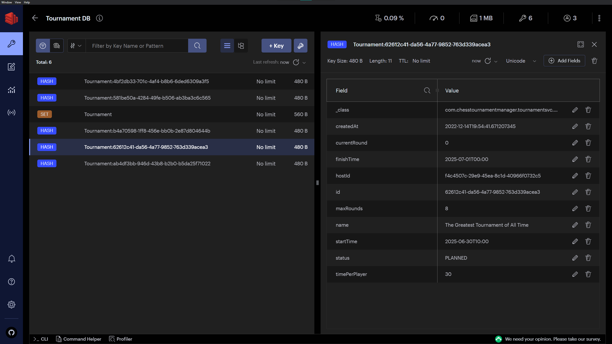

<h1> Database Research </h1>

<h2> Table of Contents </h2>

- [Introduction](#introduction)
- [My Requirements](#my-requirements)
  - [The database needs to be fast](#the-database-needs-to-be-fast)
  - [The database should be NoSQL](#the-database-should-be-nosql)
- [Database Options](#database-options)
  - [Redis](#redis)
  - [MongoDB](#mongodb)
  - [Cassandra](#cassandra)
  - [Scylla](#scylla)
- [Implementation](#implementation)
  - [Dockerizing the Application](#dockerizing-the-application)
  - [Redis Implementation](#redis-implementation)
  - [MongoDB Implementation](#mongodb-implementation)
  - [Scylla Implementation](#scylla-implementation)
- [Benchmarking](#benchmarking)
  - [Benchmark Testing With JMH in Spring Boot](#benchmark-testing-with-jmh-in-spring-boot)
  - [Results](#results)
    - [Redis](#redis-1)
    - [MongoDB](#mongodb-1)
  - [Conclusion](#conclusion)
- [Summary](#summary)
- [Sources](#sources)
- [DOT Framework Matrix](#dot-framework-matrix)

# Introduction

For this project, I need to choose a suitable database for all of my services. Since all of my services work very similar, I only want to choose one type of database. I will then use multiple instances of that database type for my services.


# My Requirements

## The database needs to be fast

I want my website to be as responsive as possible. It would be a shame if I used a slow database while using such a fast module bundler like Vite. The database must also be able to scale well, in case many people use the website. This is not that much as a requirement though. It is more important that the database is fast than it is scalable.

## The database should be NoSQL

There are multiple reasons why I don't want to use a database with SQL. First of all, SQL databases are generally slower than NoSQL databases. According to a Rochester study, key-value storage databases are especially fast (https://www.cs.rochester.edu/courses/261/fall2017/termpaper/submissions/06/Paper.pdf). Furthermore, it is easier to do scaling when using NoSQL databases. When scaling with SQL databases, you have to migrate to a more expensive server (verticle scaling). When scaling with NoSQL databases, you can just add more cheaper servers (horizontal scaling) (https://www.mongodb.com/nosql-explained/nosql-vs-sql, https://www.geeksforgeeks.org/sql-vs-nosql-which-one-is-better-to-use/). Lastly, I want to use NoSQL, because I have never used a NoSQL database in an individual project before and I would like to gain more experience by using it in this project.


# Database Options

For my database options, I decided it would be good to pick different types of NoSQL databases, to test the theory that key-value databases are the fastest. I have also picked popular databases of each type, which are said to be very fast.

## Redis
*Website: https://redis.com/*

**What type of database is Redis?**

Redis is a type of database known as a key-value database. In a key-value database, data is stored and retrieved using a unique key that identifies the particular item of data. The data (value) associated with a key can be any type of data, such as strings, integers, lists, dates, UUID's and more. Key-value databases are typically very fast and scalable, making them well-suited for applications that require quick access to large amounts of data.

[](../Images/redis_data_types.png)

*Data types in Redis*

**In what scenarios is Redis often used?**

Redis is a good option for applications which need to handle lots of small continuous reads and writes. It is more often used as a cache, but can also be used as a data store. It can also store data in-memory, which allows these actions to be done faster. It is also ideal for applications that don’t require frequent updates or need to support complex queries.

Redis is often used for the following use-cases:

- Caching
- Chatting, messaging, and queues
- Gaming leaderboards
- Session store
- Rich media streaming
- Geospatial
- Machine Learning
- Real-time analytics

For more information about these use-cases, go to [this page](https://aws.amazon.com/redis/#Popular_Redis_Use_Cases)

**How popular is Redis?**

Redis is widely used by developers. It is the sixth most popular database according to [db-engines.com](https://db-engines.com/en/system/Redis) and the most popular key-value store. Many cloud services such as AWS and Google Cloud provide Redis as a cloud service. There are also lots of articles and videos available online about Redis. 

**Which large companies use Redis?**

There are quite a few large companies using Redis. Here are a few:
- Twitter
- GitHub
- Snapchat
- StackOverflow

## MongoDB
*Website: https://www.mongodb.com/*

**What type of database is MongoDB?**

MongoDB is a document database. Document databases store and query data as JSON-like documents. The format of these documents is very similar to how objects look like within applications, which means less translation is needed to use data in an application.

**In what scenarios is MongoDB often used?**

MongoDB is often used applications where high flexibility and scalability is required. With MongoDB, it is easy to refactor documents in the database without having any database downtime. Developers also often use MongoDB when they need a solution for storing data that is nested and unsorted.

MongoDB is often used for the following use-cases:
- Big data
- Content management systems
- Customer analytics
- Real-time data integration

MongoDB is especially useful for big data. Its speed, non-relational structure and support for data analytics make it perfectly suited for handling big data.

**How popular is MongoDB?**

MongoDB is used by many developers. It is the fifth most popular database according to [db-engines.com](https://db-engines.com/en/system/MongoDB) and the most popular document store. MongoDB is also widely available on cloud services, such as AWS, Google Cloud and Microsoft Azure. A lot of developers have posted videos and articles about using MongoDB.


**Which large companies use MongoDB?**

Some large companies using MongoDB are the following:
- Toyota
- Vodafone
- Forbes

## Cassandra
*Website: https://cassandra.apache.org/_/index.html*

**What type of database is Apache Cassandra?**


**In what scenarios is Cassandra often used?**


**How popular is Cassandra?**


**Which large companies use Cassandra?**


## Scylla
*Website: https://www.scylladb.com/*

**What type of database is Scylla?**


**In what scenarios is Scylla often used?**


**How popular is Scylla?**


**Which large companies use Scylla?**


# Implementation

In this section I will show how to implement these databases to a Spring Boot project. The explanations will assume that there is already a basic API which can handle basic CRUD operations. 

## Dockerizing the Application

You can use docker to easily connect your application to a database. Docker is an open source software platform used for containerizing applicataions. Containers are basically very small virtual machines, which only contain an application and its dependencies. With docker, it's easy to run applications, because it is not necessary install all needed technologies and dependencies on your local machine. It is also very easy to use databases with docker. Usually, all you need to do is specify which database you want to use by mentioning an existing docker image. A docker image is a read-only template with instructions for creating a docker container. After you have installed docker on your machine by following [this guide](https://docs.docker.com/get-docker/), you can specify a docker image to pull in a command, or through a docker compose file. We will be using a docker compose file in this guide.

Because we will be using docker, we will also be containerizing our backend service. We will use a docker compose file for telling docker which containers to create. The compose file will point towards a docker file, which contains the specific instructions for containerizing an application. This is a simple docker file I use for each of my services:

```docker
FROM maven:3.8.6-openjdk-18-slim

ADD target/myApp.jar myApp.jar
EXPOSE 8080
ENTRYPOINT ["java","-jar","/myApp.jar"]
```

When the instructions in this file are followed when building a container, the maven docker image of the specified version will be pulled and the build from myApp will be added to that image. Then, port 8080 will be configured to be accesible from outside the container and myApp will be run as an executable.

I will show a possible docker compose file at the start of each database implementation explanation, because I am assuming you only want to implement a single database for your application. If you want to see my full docker compose file for my project, go [here](https://github.com/ChessTournamentManager/.github/blob/main/docker-compose.yml).

## Redis Implementation

Add this docker compose file to root directory of your application, where your dockerfile is also located. Give your services and volume a fitting name.
```yml
version: "3.9"

services:
  tournament-svc:
    container_name: tournament-svc
    depends_on:
      - tournament-db-redis
    image: tournament-svc
    build:
      context: .
      dockerfile: Dockerfile
    restart: on-failure
    ports:
      - "8080:8080"
  tournament-db-redis:
    container_name: tournament-db-redis
    restart: always
    image: redis:7.0.5-alpine
    ports:
      - "6379:6379"
    expose:
      - "6379"
    volumes:
      - tournament-db-volume:/var/lib/tournament-db-redis

volumes:
  tournament-db-volume:
```

When this file is run, containers will be made of your application and a Redis instance. At the end of this implementation guide, they should be able to communicate with each other.

Then add these dependencies by putting them in the pom.xml file and then reload the project.
```xml
<dependency>
  <groupId>org.springframework.boot</groupId>
  <artifactId>spring-boot-starter-data-redis</artifactId>
</dependency>
<dependency>
  <groupId>io.lettuce</groupId>
  <artifactId>lettuce-core</artifactId>
  <version>6.2.1.RELEASE</version>
</dependency>
```

Then add the `@RedisHash` bean to your domain class, and give the hash a name that fits. Then, implement the Serializable class, so that objects of the domain class can be serialized and deserialized by Redis.
```java
// More imports
import org.springframework.data.redis.core.RedisHash;

@RedisHash("Tournament")
public class Tournament implements Serializable {

    @Serial
    private static final long serialVersionUID = 6828938851562689867L;

    // Public enum Status

    @Id
    private UUID id;

    // More properties & constructors, getters and setters.
}
```

After that, go to your repository and make sure it extends the `CrudRepository` class. Then tell this class what type of model it should do CRUD operations with. Also tell it what type of object the primary key in that model is.
```java
// Imports

@Repository
public interface TournamentRepository extends CrudRepository<Tournament, UUID> {

}
```

Then add this configuration class to your project. This configuration class is responsible for connecting with the installed Redis database and serializing domain classes. In this configuration, transactions are enabled.
```java
// Imports

@Configuration
@EnableCaching
@EnableRedisRepositories
public class MainConfiguration {

    @Value("${redis.host}")
    private String redisHostName;

    @Value("${redis.port}")
    private Integer redisPort;

    @Bean
    public LettuceConnectionFactory redisLettuceConnectionFactory() {
        RedisStandaloneConfiguration redisStandaloneConfiguration = new RedisStandaloneConfiguration(redisHostName, redisPort);
        return new LettuceConnectionFactory(redisStandaloneConfiguration);
    }

    @Bean
    public RedisTemplate<byte[], byte[]> redisTemplate() {
        RedisTemplate<byte[], byte[]> redisTemplate = new RedisTemplate<>();
        redisTemplate.setConnectionFactory(redisLettuceConnectionFactory());
        redisTemplate.setKeySerializer(new StringRedisSerializer());
        redisTemplate.setHashKeySerializer(new StringRedisSerializer());
        redisTemplate.setHashKeySerializer(new JdkSerializationRedisSerializer());
        redisTemplate.setValueSerializer(new JdkSerializationRedisSerializer());
        redisTemplate.setEnableTransactionSupport(true);
        redisTemplate.afterPropertiesSet();
        return redisTemplate;
    }
}
```

Lastly, put these environment variables in your application.properties file. It is important to note that the value of `redis.host`, which is `tournament-db-redis`, aligns with the name of the docker container that I will be using that contains a redis instance.
```
redis.host=tournament-db-redis
redis.port=6379
```

Run this command to spin up your containers:
```shell
docker compose up -d --build
```

Now, the application should be able to write data into the Redis instance. To test this, you can make a POST request to your API.

[](../Images/postman_post_tournament.png)

*When making a post request, there is a response from the API.*

Then, we can go into Redis and check if the posted object is saved as intended. You could check this by using the redis-cli, but I prefer using the RedisInsight GUI.

[](../Images/redisinsight.png)

*The posted tournament within Redis.*

As you can see, the posted tournament has succesfully been saved in the database. We can also make a GET request to confirm this.

[](..Images/postman_get_tournament.png)

*Response contains the new tournament*

## MongoDB Implementation

Add this docker compose file to root directory of your application, where your dockerfile is also located. Give your services and volume a fitting name, configure the correct application port and add your chosen username and password. You could also point to an env file instead of storing them directly in your docker compose file.
```yml
version: "3.9"

services:
  player-svc:
    container_name: player-svc
    depends_on:
      - player-db-mongo
    image: player-svc
    build:
      context: .
      dockerfile: Dockerfile
    restart: on-failure
    ports:
      - "8081:8081"
  player-db-mongo:
    container_name: player-db-mongo
    restart: always
    image: mongo:5.0.14
    environment:
      - MONGO_INITDB_ROOT_USERNAME=admin
      - MONGO_INITDB_ROOT_PASSWORD=password
    ports:
      - 27017:27017
    expose:
      - 27017
    volumes:
      - player-db-volume:/var/lib/player-db-mongo

volumes:
  player-db-mongo:
```

When this file is run, containers will be made of your application and a Mongo instance. At the end of this implementation guide, they should be able to communicate with each other.

Then install this dependency for your project.
```xml
<dependency>
  <groupId>org.springframework.boot</groupId>
  <artifactId>spring-boot-starter-data-mongodb</artifactId>
</dependency>
```

Then go to your model and put the `@Document` annotation above your domain class. This way, the application knows you are trying to use MongoDB's repository, instead of the JPARepository. You can also include the `@JsonInclude(JsonInclude.Include.NON_NULL)` annotation to tell the application to remove `null` fields when serializing the class.
```java
// Imports

@Document(collection = "player")
@JsonInclude(JsonInclude.Include.NON_NULL)
public class Player {

    // Public static final fields

    @Id
    private UUID id;

    // More properties & constructors, getters and setters.
}
```

In your repository, extend the MongoRepository and insert the domain model class and the type of ID that it has.
```java
// More imports

import org.springframework.data.mongodb.repository.MongoRepository;

@Repository
public interface PlayerRepository extends MongoRepository<Player, UUID> {
}
```

In your application.properties, add these properties and rename some values to something more secure. Again, `player-db-mongo` is referring to a docker container name.
```
spring.data.mongodb.host=player-db-mongo
spring.data.mongodb.authentication-database=admin
spring.data.mongodb.username=admin
spring.data.mongodb.password=password
spring.data.mongodb.database=Player
spring.data.mongodb.port=27017
```

Run this command to spin up your containers:
```shell
docker compose up -d --build
```

The application should be able to write data into the MongoDB database.

[](../Images/postman_post_player.png)

*The response from the API.*

Then, we can go into MongoDB and check if the posted object is saved as intended. I'm using the GUI application called MongoDB Compass to do this.

[](../Images/mongodbcompass.png)

*The posted player within MongoDB.*

The player has been saved succesfully. Let's make a GET request.

[](..Images/postman_get_player.png)

*Response contains the new player*

## Scylla Implementation

Add this docker compose file to root directory of your application, where your dockerfile is also located. Give your services and volume a fitting name and configure the correct application port.
```yml
version: "3.9"

services:
  rank-svc:
    container_name: rank-svc
    depends_on: 
      - rank-db-scylla
    image: rank-svc
    build:
      context: ./rank-svc
      dockerfile: /Dockerfile
    restart: on-failure
    ports:
      - 8082:8082
  rank-db-scylla:
    container_name: rank-db-scylla
    restart: always
    image: scylladb/scylla:latest
    ports:
      - 9042:9042
    expose:
      - 9042
    volumes:
      - rank-db-volume:/var/lib/rank-db-scylla

volumes:
  rank-db-scylla:
```

When this file is run, containers will be made of your application and a Scylla instance.

Then install these dependencies in your project. With the spring-data-cossandra dependency, you can use the cassandra repositories and connect with a cassandra database. These things will also be useful with the Scylla database. The java-driver-core dependency will allow Java data to be inserted in a Scylla database.
```xml
<dependency>
  <groupId>org.springframework.data</groupId>
  <artifactId>spring-data-cassandra</artifactId>
</dependency>
<dependency>
  <groupId>com.scylladb</groupId>
  <artifactId>java-driver-core</artifactId>
  <version>4.14.1.0</version>
</dependency>
```

Add the `@Table` and `@PrimaryKey` annotations in your domain class. You can also add the `@Column` annotation to give properties a different name in the database table. In this case, I renamed them because capital letters are automatically lowercased in the database. I like using `snake_case`.
```java
// Imports

@Table(value = "rank")
public class Rank {
    private static final short DEFAULT_RANK_NUMBER = 1;

    @PrimaryKey
    private UUID id;
    @Column("tournament_id")
    private UUID tournamentId;
    @Column("player_id")
    private UUID playerId;
    @Column("rank_number")
    private short rankNumber;
    @Column("points")
    private float points;
    @Column("created_at")
    private LocalDateTime createdAt;

    // Constructors, getters and setters
}
```
In your repository, extend the CassandraRepository and insert the domain model class and the type of ID that it has.
```java
// More imports

import org.springframework.data.cassandra.repository.CassandraRepository;

public interface RankRepository extends CassandraRepository<Rank, UUID> {
}
```

Then add this configuration class to your project. This configuration class is responsible for connecting with Scylla. In this class, it is mentioned that a keyspace in Scylla will be created, if it doesn't already exist. This is very useful, because this will eliminate the need to enter the database and manually create a keyspace.
```java
// Imports

@Configuration
@EnableCassandraRepositories
public class ScyllaConfiguration extends AbstractCassandraConfiguration {

    @Value("${scylla.keyspace}")
    private String keyspace;

    @Override
    protected String getKeyspaceName() {
        return keyspace;
    }

    @Override
    protected List<CreateKeyspaceSpecification> getKeyspaceCreations() {
        final CreateKeyspaceSpecification specification =
                CreateKeyspaceSpecification.createKeyspace(keyspace)
                        .ifNotExists()
                        .with(KeyspaceOption.DURABLE_WRITES, true)
                        .withSimpleReplication();
        return List.of(specification);
    }
}
```

These are the properties and values used for this implementation. As you can see, a schema will also be created if it doesn't already exist.
```
spring.data.cassandra.contact-points=localhost
spring.data.cassandra.port=9042
spring.data.cassandra.local-datacenter=datacenter1
spring.data.cassandra.schema-action=create_if_not_exists
spring.data.cassandra.keyspace-name=rankKeyspace
scylla.keyspace=rankKeyspace
```

Run this command to spin up your containers:
```shell
docker compose up -d --build
```

At this point, I expected the the service to work and connect with the database. Unfortunately, this wasn't the case:

[](../Images/rank_error_logs.png)

In these error logs, the rank service that uses Scylla says that it cannot reach any valid contact point and tells me to make sure I have provided valid addresses. You can see that it thinks the address I have provided was `localhost/<unresolved>:9042`. The `unresolved` part is strange. There is also another large problem. When you are building an application, it should not depend on a database to start running. It should have a mocked database and should run tests without depending on a real database. I have decided not to fix this issue, because it will take too much time to do so. Instead, I will be using a mongo or redis instance for my rank service. This also means that for the upcoming benchmark tests, I will only be testing the Redis and MongoDB instances.

# Benchmarking

For benchmarking Redis and MongoDB, I have created two more Spring Boot projects, which are located in [this](https://github.com/ChessTournamentManager/Research-Benchmarks) repository. The repository also contains a docker compose file, which is used to get instances of Redis and MongoDB to run.

In the Spring Boot projects, there will be benchmark tests with Java Microbenchmark Harness (JMH) and JUnit5. Each of the projects has a Research domain class and a ResearchRepository. Since we are testing the databases, we need to use the ResearchRepository in our tests. By using JMH within the testing framework of Spring Boot, it is possible to start the application context, which means the ResearchRepository can be autowired. This is extremely important.

In the tests, we will attempt to find out what the read and write speeds of the two databases are. To find this out, we will write tests where the application will only access a mocked repository and a test where the application accesses the real repository and uses a database. We can then calucate the read and write speeds of the database. I will also write tests where only an object is created and where a variable is accessed, just to see how the time it takes to do that compares with the other tests.

The reason why I made seperate projects instead of including the benchmark tests in my existing services, is because those tests are not related to main functionality of my application. If I had included them, they would run whenever a new build of the service is made, which would be a waste of time and resources. I would have needed to find a way to exclude those specific tests when I run a build, which would cost more time to figure out than if I had just created new projects.

With that said, let's see how to write benchmark tests in Spring Boot.

## Benchmark Testing With JMH in Spring Boot

To use JMH in Spring Boot, add these dependencies in your pom.xml.
```xml
<!-- https://mvnrepository.com/artifact/org.openjdk.jmh/jmh-core -->
<dependency>
  <groupId>org.openjdk.jmh</groupId>
  <artifactId>jmh-core</artifactId>
  <version>${jmh.version}</version>
</dependency>
<!-- https://mvnrepository.com/artifact/org.openjdk.jmh/jmh-generator-annprocess -->
<dependency>
  <groupId>org.openjdk.jmh</groupId>
  <artifactId>jmh-generator-annprocess</artifactId>
  <version>${jmh.version}</version>
  <scope>test</scope>
</dependency>
```
(write comments that explain the code, and also put the comments in the project itself)

Below are the tests that I have written. This code is present in both spring-jmh-redis and spring-jmh-mongo. This makes the benchmarks more accurate. Read the comments to get a clearer understanding of what the code does.

```java
// Imports

// The @SpringBootTest annotation allows other classes to be autowired into this class.
// The @State annotation is required for a class that has fields that are being used for benchmarks.
// The @BenchmarkMode annotation allows us to customize in which format we want our benchmark results. 
// In this case, the benchmark results will show the average completion time for a single operation.
// The @OutputTimeUnit allows us to choose a time unit in which our tests are measured.
// In this case, the tests are measured in microseconds.
@SpringBootTest
@State(Scope.Benchmark)
@BenchmarkMode(Mode.AverageTime)
@OutputTimeUnit(TimeUnit.MICROSECONDS)
public class ResearchTest {

  // The real repository for our tests. This needs to be static, otherwise the autowiring won't work with JMH.
  public static ResearchRepository researchRepository;

  // Some fields that are needed for mock tests.
  @Mock
  private ResearchRepository mockedResearchRepository;
  private AutoCloseable autoCloseable;

  // The ID of the Research object that needs to be read from the database.
  private UUID readResearchId;

  // Auto-wires the repository from a set method. Normally this would be done in the constructor of this class, but
  // JMH needs this class to have the default constructor.
  @Autowired
  public void setResearchRepository(ResearchRepository researchRepository) {
      ResearchTest.researchRepository = researchRepository;
  }

  // Deletes all records in the database after each JUnit5 test.
  @AfterEach
  void tearDown() throws Exception {
      researchRepository.deleteAll();
  }

  // In this test, the benchmark options are set.
  // Even though multiple benchmark tests are being run, this is the only JUnit test in the class.
  // All benchmarks are run in this test.
  @Test
  public void runBenchmarks() throws Exception {
      Options opts = new OptionsBuilder()
              // Set the class name regex for benchmarks to search for to the current class.
              .include("\\." + this.getClass().getSimpleName() + "\\.")
              // Do not use forking or the benchmark methods will not see references stored within its class.
              .forks(0)
              // Do not use multiple threads.
              .threads(1)
              .shouldDoGC(true)
              .shouldFailOnError(true)
              .jvmArgs("-server")
              .build();

      new Runner(opts).run();
  }

  // Saves a research object in the database and stores its ID in the 'readResearchId' field. 
  // This is useful for the read test. The autocloseable enables mocking within our benchmark tests.
  @Setup(Level.Trial)
  public void initBenchmark() {
      Research research = new Research("Very Cool Research", 20000);
      readResearchId = research.getId();
      researchRepository.save(research);
      autoCloseable = MockitoAnnotations.openMocks(this);
  }

  // Cleans up resources by closing the autocloseable after the completion of each benchmark.
  @TearDown(Level.Trial)
  public void endBenchmark() throws Exception {
      autoCloseable.close();
  }

  // The first benchmark test. In this benchmark, a Research object is created.
  // After that, the black hole object will consume the object.
  // This prevents the compiler from optimizing the object creation code after it has already executed it.
  // The @Benchmark annotation registers this method as a benchmark test.
  // The @Warmup annotation allows us to customize how many warmup runs are done before the real benchmarking begins.
  // In this case, 3 warmup iterations are done. Each iteration takes 10 milliseconds to complete.
  // The @Measurement annotation allows us to customize how many runs are done during the benchmark.
  // In this case, 20 iterations are done. Each iteration takes 10 milliseconds to complete.
  @Benchmark
  @Warmup(iterations = 3, time = 10, timeUnit = TimeUnit.MILLISECONDS)
  @Measurement(iterations = 20, time = 10, timeUnit = TimeUnit.MILLISECONDS)
  public void BM1_CreateObject(Blackhole blackhole) {
      blackhole.consume(new Research("Cool Research", 5000));
  }

  // The second benchmark test.
  // In this benchmark, a Research object is created and the 'save' method of a mocked repository is being called.
  // Each iteration now takes 200 milliseconds.
  @Benchmark
  @Warmup(iterations = 3, time = 200, timeUnit = TimeUnit.MILLISECONDS)
  @Measurement(iterations = 20, time = 200, timeUnit = TimeUnit.MILLISECONDS)
  public void BM2_MockWriteObject() {
      mockedResearchRepository.save(new Research("Cool Research", 5000));
  }

  // The third benchmark test.
  // In this benchmark, a Research object is created, the 'save' method of the repository is being called.
  // Then, the database executes a write operation and saves the Research object.
  // Each iteration now takes a second to complete.
  @Benchmark
  @Warmup(iterations = 3, time = 1000, timeUnit = TimeUnit.MILLISECONDS)
  @Measurement(iterations = 20, time = 1000, timeUnit = TimeUnit.MILLISECONDS)
  public void BM3_WriteObject() {
      researchRepository.save(new Research("Cool Research", 5000));
  }

  // The fourth benchmark test.
  // In this benchmark, the value of the 'readResearchId' variable is being retrieved.
  // The results of this benchmark are measured in nanoseconds instead of microseconds.
  // Nanoseconds are chosen here, because each operation happens very quickly.
  // Choosing a smaller time unit increases the accuracy of the results.
  @Benchmark
  @Warmup(iterations = 3, time = 10, timeUnit = TimeUnit.MILLISECONDS)
  @Measurement(iterations = 20, time = 10, timeUnit = TimeUnit.MILLISECONDS)
  @OutputTimeUnit(TimeUnit.NANOSECONDS)
  public void BM4_RetrieveKey(Blackhole blackhole) {
      blackhole.consume(readResearchId);
  }

  // The fifth benchmark test.
  // In this benchmark, the value of the 'readResearchId' variable is being retrieved.
  // Then, the 'findById' method of a mocked repository is being called.
  @Benchmark
  @Warmup(iterations = 3, time = 200, timeUnit = TimeUnit.MILLISECONDS)
  @Measurement(iterations = 20, time = 200, timeUnit = TimeUnit.MILLISECONDS)
  public void BM5_MockReadObject(Blackhole blackhole) {
      blackhole.consume(mockedResearchRepository.findById(readResearchId));
  }

  // The sixth benchmark test.
  // In this benchmark, the value of the 'readResearchId' variable is being retrieved.
  // Then, the 'findById' method of the repository is being called.
  // Then, the database executes a read operation with the passed ID and reads the correct Research object.
  @Benchmark
  @Warmup(iterations = 3, time = 1000, timeUnit = TimeUnit.MILLISECONDS)
  @Measurement(iterations = 20, time = 1000, timeUnit = TimeUnit.MILLISECONDS)
  public void BM6_ReadObject(Blackhole blackhole) {
      blackhole.consume(researchRepository.findById(readResearchId));
  }
}
```

## Results

### Redis

These are some gained results when running all benchmark tests a couple of times on the project using Redis.
```shell
Benchmark                                        Mode  Cnt     Score    Error  Units
BenchmarkTests.ResearchTest.BM1_CreateObject     avgt   20     0,453 ±  0,096  μs/op
BenchmarkTests.ResearchTest.BM2_MockWriteObject  avgt   20     7,487 ±  1,144  μs/op
BenchmarkTests.ResearchTest.BM3_WriteObject      avgt   20  1471,553 ± 86,037  μs/op
BenchmarkTests.ResearchTest.BM4_RetrieveKey      avgt   20     1,932 ±  0,486  ns/op
BenchmarkTests.ResearchTest.BM5_MockReadObject   avgt   20     6,550 ±  1,220  μs/op
BenchmarkTests.ResearchTest.BM6_ReadObject       avgt   20   508,009 ± 17,804  μs/op
```
```shell
Benchmark                                        Mode  Cnt     Score    Error  Units
BenchmarkTests.ResearchTest.BM1_CreateObject     avgt   20     0,512 ±  0,079  μs/op
BenchmarkTests.ResearchTest.BM2_MockWriteObject  avgt   20     7,686 ±  1,285  μs/op
BenchmarkTests.ResearchTest.BM3_WriteObject      avgt   20  1440,975 ± 56,816  μs/op
BenchmarkTests.ResearchTest.BM4_RetrieveKey      avgt   20     2,246 ±  0,253  ns/op
BenchmarkTests.ResearchTest.BM5_MockReadObject   avgt   20     6,442 ±  1,096  μs/op
BenchmarkTests.ResearchTest.BM6_ReadObject       avgt   20   481,405 ± 30,292  μs/op
```
```shell
Benchmark                                        Mode  Cnt     Score    Error  Units
BenchmarkTests.ResearchTest.BM1_CreateObject     avgt   20     0,371 ±  0,074  μs/op
BenchmarkTests.ResearchTest.BM2_MockWriteObject  avgt   20     7,340 ±  0,981  μs/op
BenchmarkTests.ResearchTest.BM3_WriteObject      avgt   20  1467,443 ± 63,883  μs/op
BenchmarkTests.ResearchTest.BM4_RetrieveKey      avgt   20     2,363 ±  0,658  ns/op
BenchmarkTests.ResearchTest.BM5_MockReadObject   avgt   20     6,496 ±  1,547  μs/op
BenchmarkTests.ResearchTest.BM6_ReadObject       avgt   20   483,402 ± 26,273  μs/op
```
```shell
Benchmark                                        Mode  Cnt     Score     Error  Units
BenchmarkTests.ResearchTest.BM1_CreateObject     avgt   20     0,515 ±   0,060  μs/op
BenchmarkTests.ResearchTest.BM2_MockWriteObject  avgt   20     7,821 ±   1,327  μs/op
BenchmarkTests.ResearchTest.BM3_WriteObject      avgt   20  1472,734 ± 110,542  μs/op
BenchmarkTests.ResearchTest.BM4_RetrieveKey      avgt   20     2,338 ±   0,666  ns/op
BenchmarkTests.ResearchTest.BM5_MockReadObject   avgt   20     6,151 ±   0,598  μs/op
BenchmarkTests.ResearchTest.BM6_ReadObject       avgt   20   492,332 ±  25,030  μs/op
```
```shell
Benchmark                                        Mode  Cnt     Score    Error  Units
BenchmarkTests.ResearchTest.BM1_CreateObject     avgt   20     0,532 ±  0,066  μs/op
BenchmarkTests.ResearchTest.BM2_MockWriteObject  avgt   20     7,975 ±  1,253  μs/op
BenchmarkTests.ResearchTest.BM3_WriteObject      avgt   20  1464,015 ± 57,588  μs/op
BenchmarkTests.ResearchTest.BM4_RetrieveKey      avgt   20     2,363 ±  0,672  ns/op
BenchmarkTests.ResearchTest.BM5_MockReadObject   avgt   20     6,439 ±  1,115  μs/op
BenchmarkTests.ResearchTest.BM6_ReadObject       avgt   20   496,809 ± 25,369  μs/op
```

For each benchmark result, it is displayed what the mode, amount of iterations, score, error margin and time unit is. For each iteration, several operations took place and the average time per operation was calulated. The score you see here, is the average time of all the calculated times of the iterations.

If we look at these results, we can calculate the average read time by taking the average of BM3's results and subtracting the average BM2 result from it:

$$\frac{1471,553+1440,975+1467,443+1472,734+1464,015}{5} - \frac{7,487+7,686+7,340+7,821+7,975}{5} = 1455,682$$

So the amount of time it takes for Redis to write an object is about **1456 microseconds**. The average error margin is about 80 microseconds.

Let's calculate the read time as well. We can calculate the average read time by taking the average of BM6's results and subtracting the average BM5 result from it:

$$\frac{508,009+481,405+483,402+492,332+496,809}{5} - \frac{6,550+6,442+6,496+6,151+6,439}{5} = 485,976$$

So the amount of time it takes for Redis to read an object is about **486 microseconds**. The average error margin is about 24 microseconds.

### MongoDB

These are some gained results when running all benchmark tests a couple of times on the project using MongoDB.
```shell
Benchmark                                        Mode  Cnt    Score     Error  Units
BenchmarkTests.ResearchTest.BM1_CreateObject     avgt   20    0,361 ±   0,078  μs/op
BenchmarkTests.ResearchTest.BM2_MockWriteObject  avgt   20    3,354 ±   0,816  μs/op
BenchmarkTests.ResearchTest.BM3_WriteObject      avgt   20  647,216 ± 168,074  μs/op
BenchmarkTests.ResearchTest.BM4_RetrieveKey      avgt   20    2,311 ±   0,654  ns/op
BenchmarkTests.ResearchTest.BM5_MockReadObject   avgt   20    6,526 ±   1,118  μs/op
BenchmarkTests.ResearchTest.BM6_ReadObject       avgt   20  569,395 ±  20,337  μs/op
```
```shell
Benchmark                                        Mode  Cnt    Score     Error  Units
BenchmarkTests.ResearchTest.BM1_CreateObject     avgt   20    0,457 ±   0,092  μs/op
BenchmarkTests.ResearchTest.BM2_MockWriteObject  avgt   20    7,310 ±   1,297  μs/op
BenchmarkTests.ResearchTest.BM3_WriteObject      avgt   20  660,766 ± 116,527  μs/op
BenchmarkTests.ResearchTest.BM4_RetrieveKey      avgt   20    2,333 ±   0,649  ns/op
BenchmarkTests.ResearchTest.BM5_MockReadObject   avgt   20    5,698 ±   0,538  μs/op
BenchmarkTests.ResearchTest.BM6_ReadObject       avgt   20  613,367 ±  40,552  μs/op
```
```shell
Benchmark                                        Mode  Cnt    Score    Error  Units
BenchmarkTests.ResearchTest.BM1_CreateObject     avgt   20    0,456 ±  0,079  μs/op
BenchmarkTests.ResearchTest.BM2_MockWriteObject  avgt   20    7,545 ±  1,703  μs/op
BenchmarkTests.ResearchTest.BM3_WriteObject      avgt   20  618,857 ± 43,952  μs/op
BenchmarkTests.ResearchTest.BM4_RetrieveKey      avgt   20    1,773 ±  0,401  ns/op
BenchmarkTests.ResearchTest.BM5_MockReadObject   avgt   20    5,857 ±  0,453  μs/op
BenchmarkTests.ResearchTest.BM6_ReadObject       avgt   20  600,871 ± 27,410  μs/op
```
```shell
Benchmark                                        Mode  Cnt    Score    Error  Units
BenchmarkTests.ResearchTest.BM1_CreateObject     avgt   20    0,484 ±  0,080  μs/op
BenchmarkTests.ResearchTest.BM2_MockWriteObject  avgt   20    7,460 ±  1,318  μs/op
BenchmarkTests.ResearchTest.BM3_WriteObject      avgt   20  629,476 ± 73,287  μs/op
BenchmarkTests.ResearchTest.BM4_RetrieveKey      avgt   20    1,847 ±  0,438  ns/op
BenchmarkTests.ResearchTest.BM5_MockReadObject   avgt   20    6,063 ±  0,923  μs/op
BenchmarkTests.ResearchTest.BM6_ReadObject       avgt   20  607,044 ± 52,850  μs/op
```
```shell
Benchmark                                        Mode  Cnt    Score     Error  Units
BenchmarkTests.ResearchTest.BM1_CreateObject     avgt   20    0,519 ±   0,062  μs/op
BenchmarkTests.ResearchTest.BM2_MockWriteObject  avgt   20    7,752 ±   1,436  μs/op
BenchmarkTests.ResearchTest.BM3_WriteObject      avgt   20  664,407 ± 130,880  μs/op
BenchmarkTests.ResearchTest.BM4_RetrieveKey      avgt   20    1,763 ±   0,365  ns/op
BenchmarkTests.ResearchTest.BM5_MockReadObject   avgt   20    6,430 ±   1,184  μs/op
BenchmarkTests.ResearchTest.BM6_ReadObject       avgt   20  596,001 ±  35,009  μs/op
```

If we look at these results, we can already see that the read and write times are a bit different. We can calculate the average read time by taking the average of BM3's results and subtracting the average BM2 result from it:

$$\frac{647,216+660,766+618,857+629,476+664,407}{5} - \frac{3,354+7,310+7,545+7,460+7,752}{5} = 637,4602$$

So the amount of time it takes for MongoDB to write an object is about **637 microseconds**. The average error margin is about 110 microseconds.

Let's calculate the read time as well. We can calculate the average read time by taking the average of BM6's results and subtracting the average BM5 result from it:

$$\frac{569,395+613,367+600,871+607,044+596,001}{5} - \frac{6,526+5,698+5,857+6,063+6,430}{5} = 591,221$$

So the amount of time it takes for Redis to read an object is about **591 microseconds**. The average error margin is about 35 microseconds.


## Conclusion

In the benchmarks, the results are quite clear. MongoDB is much faster at writing objects than Redis is, and a bit slower at reading objects than Redis is. MongoDB does have a larger margin of error at the writing times, which means its write times are more inconsistent. Perhaps MongoDB performs worse when the application is under a high workload and has a multi-threaded environment. It doesn't seem likely that Redis will outperform MongoDB in write operations though, especially in large applications, when working in an environment with many billions of records.

It was quite surprising to see MongoDB outperform Redis for write operations. After reading some articles online, I realized that this is most likely because I used Redis as a datastore and not as a cache. According to [this article](https://www.mongodb.com/compare/mongodb-vs-redis), Redis can handle millions of requests per second when used as a cache. This means that an operation can take less than a microsecond when implemented properly. This makes it very tempting to use Redis as a cache and MongoDB as a datastore. The architecture of the application would then look similar to this:

[](../Images/potential_application_architecture.jpg)

*In this case, the database would be a MongoDB database.*

It is also possible to use MongoDB as a cache, but Redis is generally faster. In [this article](https://dev.to/playtomic/redis-vs-mongodb-fight-1481) and [this article](https://scalegrid.io/blog/comparing-in-memory-databases-redis-vs-mongodb-percona-memory-engine/), both Redis and MongoDB were used as a cache and were benchmarked. The results are as expected.

Because Redis is often use as a cache and not as a datastore, it was quite hard to find benchmarks from other people who did the same experiment I did. From the information gathered, we can safely say that, although Redis' speeds as a datastore are still quite fast, MongoDB is better suited as a datastore and Redis is better suited for caching.

Other than the choice of database to use as a datastore, there are also other factors which could influence read and write speed in a production environment. For example, if you are using databases on a cloud service, you are dependant on the network speed of the cloud service and the hardware they use. Workload and OS optimization are also important factors.

# Summary

(Write this when you refactored the document with all the questions. It will then become easier to write a summary.)

# Sources


# DOT Framework Matrix

